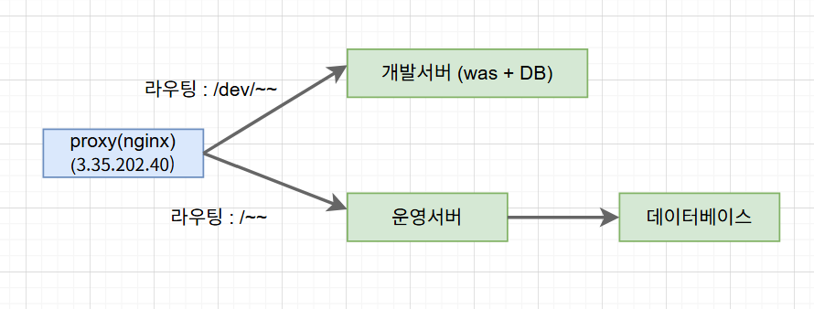

# 공용 도서실 자리 예약 시스템

## 기능 명세서
### 회원 가입 (전체 사용자)

- [x] 이메일과 비밀번호를 통해 회원가입을 할 수 있다.
- [x]  이메일로 회원가입은 불가능하다.

### 로그인 (전체 사용자)

- [x] 이메일과 비밀번호를 통해 로그인을 할 수 있다.

### 로그아웃 (젠체 사용자)

- [x] 로그아웃을 할 수 있다.

### 예약 (일반 회원)

- [x] 특정 날짜의 특정 자리를 선택해 예약할 수 있다.
- 공휴일은 에약이 불가능하다.
- [x] 예약은 하루 단위로 진행된다.
- [x] 이미 예약된 자리의 경우 예약이 불가능하다.
- [x] 과거의 날짜로는 예약이 불가능하다.

### 예약 사유 수정 (일반 회원)

- [x] 자신의 예약의 예약 사유를 수정할 수 있다.
- [x] 다른 사람의 예약 사유를 수정할 수 없다.

### 예약 삭제 (일반 회원)

- [x] 자신의 예약을 삭제할 수 있다.
- [x] 다른 사람의 예약을 삭제할 수 없다.

### 자신의 예약 리스트 확인

- [x] 자신의 예약 리스트를 확인할 수 있다.

### 자신의 예약의 세부사항 확인 (일반 회원)

- [x] 자신 예약의 세부 내용을 확인할 수 있다.
- [x] 다른 사람의 예약의 세부내용을 확인할 수 없다.

### 날짜별 자리 예약 현황 확인 (전체 사용자)

- [x] 특정 자리의 예약을 확인할 수 있다.

## 인프라 구조

### 개발 서버 EC2에 was와 db를 모두 배치한 이유
규모가 작은 프로젝트이기 때문에 개발서버에 대한 db를 따로 분리할 필요성을 못느꼈습니다!
이후에 규모가 커지고 개발서버에 들어가야하는 데이터의 양도 많아지게 된다면 그때가서
db를 별도의 rds나 ec2로 분리하는 방향으로 리펙토링을 할 생각입니다!

### proxy를 활용해서 개발서버, 운영서버, 운영DB를 bastion 방식으로 접근한 이유
현재 권한문제로 인해 SSM 접속이 되지 않는 상황이었습니다. 그래서 시간 관계상 개발서버, 운영서버, 운영DB를
외부에서 접근하지 못하도록 private으로 만들어놓고, public 상태인 proxy를 통해 bastion 방식으로 접근하도록
했습니다. 지금은 시간이 부족해 디버깅 하지 못햇지만 SSM접속이 된다면 proxy 서버에 존재하는 key를 제거하고
private ec2에 SSM 방식으로 접근하도록 리펙토링 해볼 수 있을 것 같습니다!

### CI/CD 과정을 적용하지 못한 이유
인프라 관련 실력이 부족했습니다! CICD를 고려하지 않고 우선은 기본 요구사항에 맞게 개발환경과 운영환경을 구축하는
것을 목표로 했습니다. 부족한 실력으로 인해 환경을 구축하는데 많은 시간이 들었고 CICD까지는 미처 적용하지 못했습니다.
이번 기회를 통해 저의 부족함을 확실하게 파악할 수 있었고, 개인 AWS 계정을 활용한 실습을 통해 인프라에 더욱 가짜워질
수 있도록 노력하겠습니다!

## 최종 미션 요구 사항

### 필수 요구사항

- [x]  애플리케이션을 AWS에 배포 가능한 상태로 구축해야 한다.
- [x]  애플리케이션 서버와 데이터베이스 서버를 물리·네트워크 계층에서 분리
- [x]  개발(dev)과 운영(prod)의 설정을 서로 독립적으로 관리·배포

### **추가 요구사항(선택)**

- [ ]  소스 변경 시 자동 빌드·배포가 수행되도록 파이프라인을 구성해야 한다.
- [ ]  개인 도메인을 애플리케이션에 연결하고 HTTPS를 적용해야 한다.
- [ ]  애플리케이션 로그를 파일 또는 수집기로 영속화하고 조회 절차를 제공해야 한다.
- [ ]  서버 자원(CPU·메모리·네트워크 등)을 지표·대시보드로 시각화해야 한다.
- [ ]  운영 중 스키마 변경 시 데이터 보존 상태로 마이그레이션 및 재배포를 완료해야 한다.
- [ ]  제공 API의 문서 명세를 작성·공개해야 한다.
- [x]  전체 인프라를 다이어그램으로 작성하고 각 구성요소 역할을 설명해야 한다.

